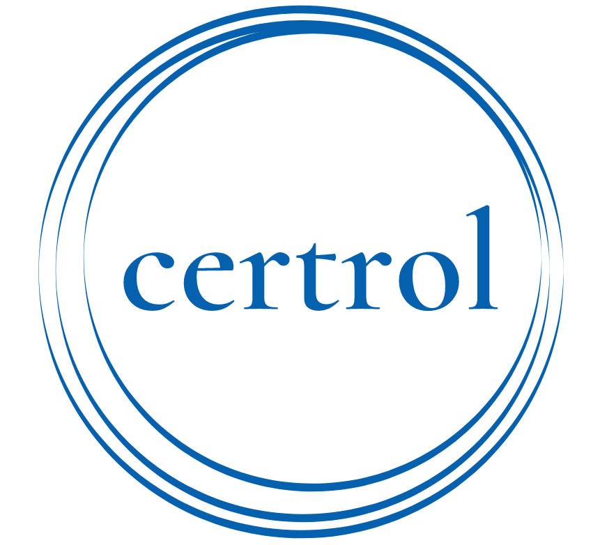

<div align="center">
    
</div>

## Introduction

Certrol is a tool-box for machine learning-based certifiable controller synthesis. Certrol currently supports the following algorithms:

1. [Learning the Control Contraction Metric](./C3M)
2. [Safe Control for Multi-agent Systems with Decentralized Control Barrier Functions](./macbf)
3. [Safe Control for Black-box Dynamical Systems with Control Barrier Functions](./sablas)
4. [Safe Nonlinear Control Using Robust Neural Lyapunov-Barrier Functions](./neural_clbf)

## Installation

Certrol relies on a number of submodules. To clone the Certrol repository and each submodule, run
```
git clone git@github.com:MIT-REALM/certrol.git
git submodule init
git submodule update
```

Then follow the installation instructions for each submodule you are interested in using.

## Licenses

Licenses for each submodule are maintained within each submodule. In summary:

1. `C3M` has a TODO license
2. `macbf` has a TODO license
3. `sablas` has a TODO license
4. `neural_clbf` has a 3-clause BSD license.

## Citation

If you find this project useful in your research, please consider citing:

```bibtex
@article{sun2020learning,
  title = {Learning certified control using contraction metric},
  author = {Sun, Dawei and Jha, Susmit and Fan, Chuchu},
  booktitle = {Proceedings of the Conference on Robot Learning},
  year = {2020}
}

@article{qin2021learning,
  title={Learning Safe Multi-agent Control with Decentralized Neural Barrier Certificates },
  author={Qin, Zengyi and Zhang, Kaiqing and Chen, Yuxiao and Chen, Jingkai and Fan, Chuchu},
  booktitle={International Conference on Learning Representations},
  year={2021}
}

@ARTICLE{qin2021sablas,
  author={Qin, Zengyi and Sun, Dawei and Fan, Chuchu},
  journal={IEEE Robotics and Automation Letters},
  title={Sablas: Learning Safe Control for Black-Box Dynamical Systems},
  year={2022},
  volume={7},
  number={2},
  pages={1928-1935},
  doi={10.1109/LRA.2022.3142743}
}

@article{dawson2021safe,
  title={Safe Nonlinear Control Using Robust Neural Lyapunov-Barrier Functions},
  author={Charles Dawson, Zengyi Qin, Sicun Gao, Chuchu Fan},
  journal={5th Annual Conference on Robot Learning},
  year={2021}
}

@article{dawson2022perception,
  author={Dawson, Charles and Lowenkamp, Bethany and Goff, Dylan and Fan, Chuchu},
  journal={IEEE Robotics and Automation Letters},
  title={Learning Safe,
  Generalizable Perception-Based Hybrid Control With Certificates},
  year={2022},
  volume={7},
  number={2},
  pages={1904-1911},
  doi={10.1109/LRA.2022.3141657}
}
```
